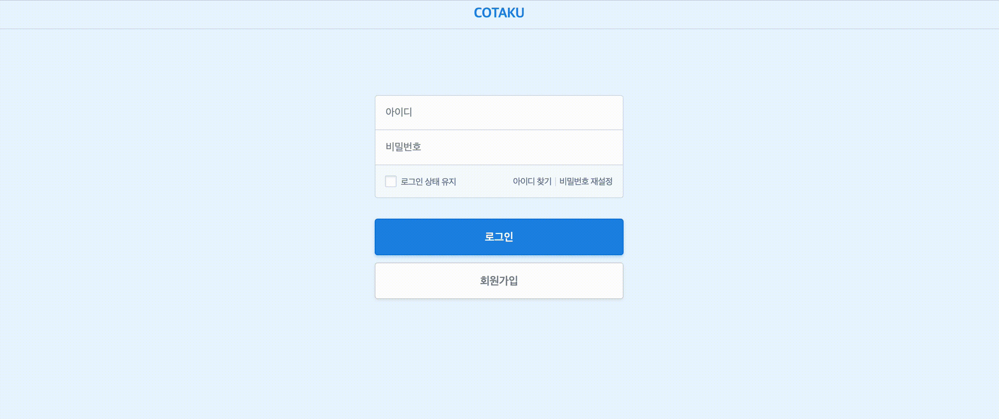
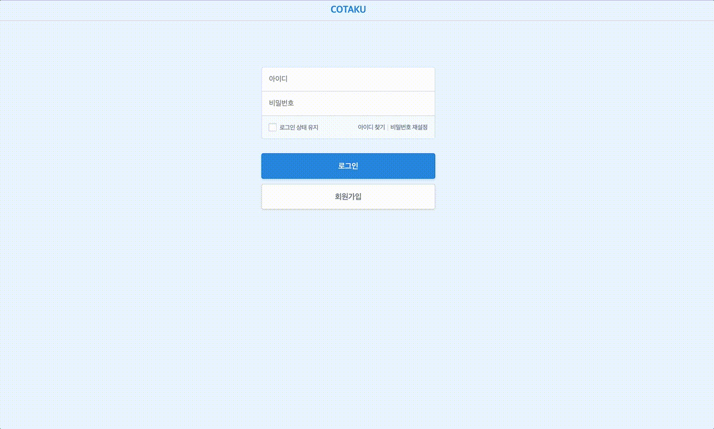
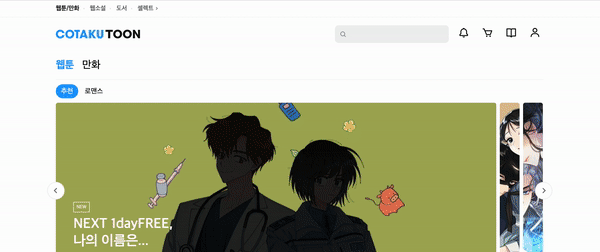
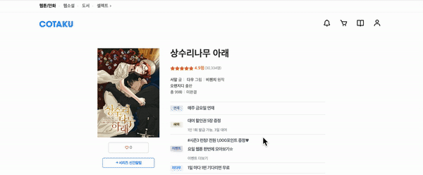
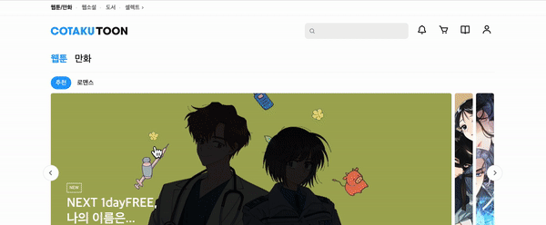
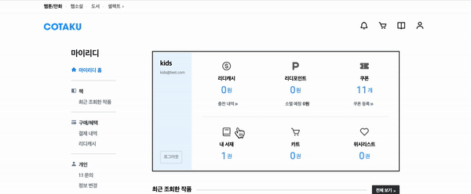
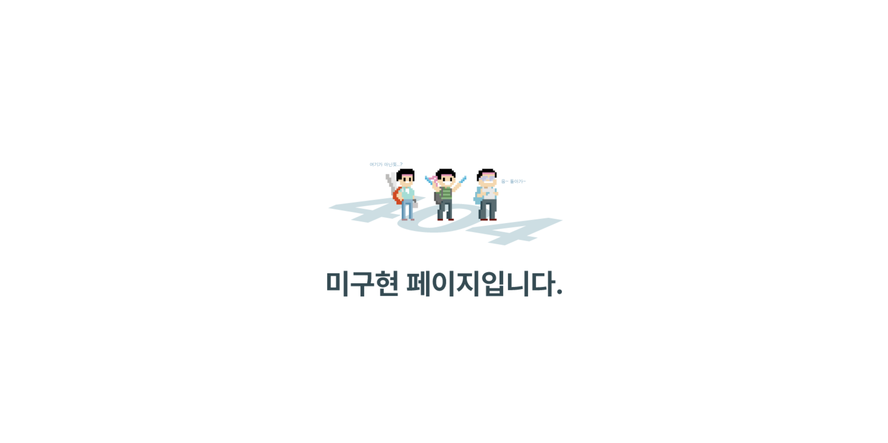

# 📚 기존 COTAKU 프로젝트를 Next.js + Typescript로 만든 프로젝트입니다.

- 배포: https://cotaku-toon-next.vercel.app/

### 프로젝트 설명

기존 VanillaJS로 만들었었던 Ridi웹툰의 clone 프로젝트를 NextJS + Typescript로 만들어 본 프로젝트 입니다.

기존 VanillaJS 프로젝트는 팀원 3명과 같이 한 프로젝트 였지만 이 프로젝트는 혼자서 만들어 본 프로젝트이고 만들었던 기능들을 보지 않고 오로지 혼자서 생각해서 만들어본 프로젝트입니다.

### 기술 스택

        
   

### 기능 구현 사진
|                                  로그인                                  |                                 회원가입                                  |
| :----------------------------------------------------------------------: | :-----------------------------------------------------------------------: |
|  |  |

|                                  캐러셀                                  |                               검색 기능                               |
| :----------------------------------------------------------------------: | :-------------------------------------------------------------------: |
|  |  |

|                                  회차페이지                                  |                                 뷰어                                  |
| :--------------------------------------------------------------------------: | :-------------------------------------------------------------------: |
|  |  |

|                                  최근조회목록                                  |                       성인 인증에 따른 Thumbnail 변경                       |
| :----------------------------------------------------------------------------: | :-------------------------------------------------------------------------: |
|  |  |

| 미구현 페이지  
| :----------------------------------------------------------------------: |
| 

## ⚙️ 기능 구현
- #### 메인 홈페이지
  - 최상단 Carousel을 제외한 나머지 Carousel은 react-slick 라이브러리를 이용해 기능 구현
  - 최상단 Carousel은 InfiniteCarousel로 useEffect를 이용한 setTimeout을 통해 구현
    - [ISSUE](https://github.com/Anjiwoong/COTAKUToon-Next-Typescript/issues/64) setTimeout 사용 실수로 인한 ISSUE정리
  - next-auth를 이용한 `useSession()` 훅으로 로그인 유저의 성인 여부를 알아 내 성인 일 때와 미성년자일 경우 각 다른 썸네일 표시
  - Image 태그에 **`placeholder="blur" blurDataURL={blurDataURL}`** 추가해 렌더링이 아직 안됐을 경우 회색 배경의 블러처리된 이미지를 먼저 보여주고 렌더링 구현
  
- #### 로그인 / 회원가입 페이지
  - next-auth(credentials) 방식을 이용해 회원가입 및 로그인 기능 구현
  - MongoDB에 유저 정보를 저장
  - next-auth의 `useSession()` 훅으로 현재 로그인한 유저의 정보를 받아올 수 있다.
  
- #### 마이 페이지
  - mypage는 로그인 여부에 따라 접근이 불가능하게 getServerSideProps로 매 요청시마다 로그인 여부를 확인해 Redirect 설정
  - 웹툰 클릭시 로그인 유저의 DB에 웹툰 정보를 추가해 최근 조회한 목록에 로그인한 유저의 최근 조회한 웹툰들이 나오게 구현
  - `use-webtoon` custom-hook을 만들어 swr로 DB에 접근해 최근 조회한 목록 데이터를 가져왔다.
  - next-auth에서 제공하는 `signOut()` 으로 로그아웃 기능 구현
  
- #### 웹툰 페이지
  - 클릭한 웹툰의 아이디가 path값으로 전달되기 때문에 getStaticProps에서 `const webtoonId = params?.webtoonId?.toString();`으로 클릭한 웹툰의 데이터 추출
  - 웹툰 별점 / 댓글 기능 구현

- #### 웹툰 View 페이지
  - 웹툰 View의 view setting 컴포넌트를 이용해 zoom, 화면 theme 색상 등 설정 가능

### Commit Convention

| Tag Name  | Description                                                                                   |
| :-------: | :-------------------------------------------------------------------------------------------- |
|   Feat    | 새로운 기능을 추가                                                                            |
|    Fix    | 버그 수정                                                                                     |
|  Design   | CSS 등 사용자 UI 디자인 변경                                                                  |
| !BREAKING | CHANGE 커다란 API 변경의 경우                                                                 |
|  !HOTFIX  | 급하게 치명적인 버그를 고쳐야하는 경우                                                        |
|   Style   | 코드 포맷 변경, 세미 콜론 누락, 코드 수정이 없는 경우                                         |
| Refactor  | 프로덕션 코드 리팩토링                                                                        |
|  Comment  | 필요한 주석 추가 및 변경                                                                      |
|   Docs    | 문서 수정                                                                                     |
|   Test    | 테스트 코드, 리펙토링 테스트 코드 추가, Production Code(실제로 사용하는 코드) 변경 없음       |
|   Chore   | 빌드 업무 수정, 패키지 매니저 수정, 패키지 관리자 구성 등 업데이트, Production Code 변경 없음 |
|  Rename   | 파일 혹은 폴더명을 수정하거나 옮기는 작업만인 경우                                            |
|  Remove   | 파일을 삭제하는 작업만 수행한 경우                                                            |
